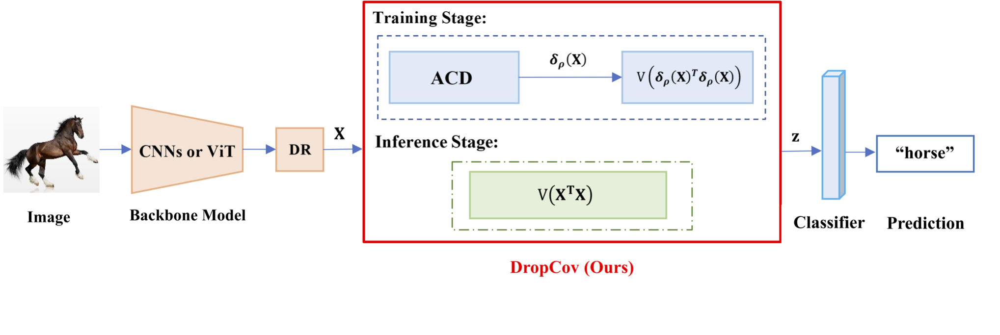

# DropCov

This is an code implementation of NeurIPS2022 paper ([DropCov: A Simple yet Effective Method for Improving Deep Architectures](https://arxiv.org/) ([poster](https://github.com/))), created by Qilong Wang, Mingze Gao and Zhaolin Zhang.


## Introduction
 In this paper, we found that the exsisting post-normalization methods of GCP pay more close attention to effect of normalization on covariance representations rather than the whole GCP networks, our work show that effective post-normalization can make a good trade-off between representation decorrelation and information preservation for GCP, which
are crucial to alleviate over-fitting and increase representation ability of deep GCP networks, respectively.Based on this finding, we improve existing postnormalization methods with some small modifications, providing further support to our observation.Furthermore, this finding encourages us to propose a novel pre-normalization method for GCP (namely DropCov), which is a simple dropout-based method to replace the exsisting global corvariance pooling (GCP)'s post-normalization by excuting channel-dropout considering both representation decorrelation and information perservation.



## Main Results on ImageNet with Pretrained Models


|Method           | Acc@1(%) | #Params.(M) | FLOPs(G) | Checkpoint                                                          |
| ------------------ | ----- | ------- | ----- | ------------------------------------------------------------ |
| ResNet-34   |  74.19 |  21.8   |  3.66   ||
| ResNet-50   |  76.02 |  25.6   |   3.86  |               |
| ResNet-101   |  77.67 |    44.6 | 7.57    |               |
| ResNet-34+DropCov(Ours)   | 76.81  |  29.6   | 5.56    | [Download](https://drive.google.com/file/d/1rAK-u85tYxhodTDBV_QuIjXFlxz7Ul2t/view?usp=sharing)|
| ResNet-50+DropCov(Ours)   | 78.19  |   32.0  |  6.19   |[Download](https://drive.google.com/file/d/1235CUjS7va_h6weWQeAwFZ_J1iOqmaDm/view?usp=sharing)|
| ResNet-101+DropCov(Ours)    |  79.51 |    51.0 |   9.90  |[Download](https://drive.google.com/file/d/1KJyAUXu11GFz6uLS1kGyZc1JM-pi-E37/view?usp=sharing)|
| DeiT-S   |  79.8 |  22.1   |   4.6  |[Link](https://drive.google.com/file/d/1Tmz1YxfwLFUDZTovjb--pGgFMvZmXyDq/view?usp=sharing)|
| Swin-T   |  81.2 |   28.3  |     4.5|[Link](https://drive.google.com/file/d/1vZgq0llSlV2H9lS95VbbM6QLtrzpp8Ut/view?usp=sharing) |
| T2T-ViT-14   |  81.5 |    21.5 |   5.2  |[Link](https://drive.google.com/file/d/1b7vNbniADAJ_ZuLDOA0Zsx9iNqhMbqkJ/view?usp=sharing)|
| DeiT-S+DropCov(Ours)   | 82.4  |   25.6  |    5.5 |[Download](https://drive.google.com/file/d/1Ziw9dRvainxIQlq_9htZ58inr6nRsPmx/view?usp=sharing)|
| Swin-T-S+DropCov(Ours)  |  82.5 |   31.6  |   6.0  |[Download](https://drive.google.com/file/d/1w4gyTBJ9b_Rg9xj9bjA__yJ7GECMMtqM/view?usp=sharing)|
| T2T-ViT-14-S+DropCov(Ours)   | 82.7  |  24.9   |    5.4 |[Download](https://drive.google.com/file/d/1KQmJ7cZjDPy4WOmOGAPGr9wbBWaQGNPo/view?usp=sharing)|
## Usage
### Environments
●OS：18.04  
●CUDA：11.0  
●Toolkit：PyTorch 1.7\1.8  
●GPU:GTX 2080Ti\3090Ti  

### Install
First, clone the repo and install requirements:

```bash
git clone https://github.com/mingzeG/DropCov.git
pip install -r requirements.txt
```

### Data preparation

Download and extract ImageNet train and val images from http://image-net.org/. 
The directory structure is the standard layout for the torchvision [`datasets.ImageFolder`](https://pytorch.org/docs/stable/torchvision/datasets.html#imagefolder), 
and the training and validation data is expected to be in the `train/` folder and `val/` folder respectively:

```
/path/to/imagenet/
  train/
    class1/
      img1.jpeg
    class2/
      img2.jpeg
  val/
    class1/
      img3.jpeg
    class/2
      img4.jpeg
```

### Evaluation

To evaluate a pre-trained model on ImageNet val with GPUs run:

```bash
CUDA_VISIBLE_DEVICES={device_ids}  python  -u main.py  -e -a {model_name} --resume {checkpoint-path} {imagenet-path}
```

For example, to evaluate the Dropcov method, run

```bash
CUDA_VISIBLE_DEVICES=0,1,2,3 python  -u main.py  -e -a resnet18_ACD --resume ./r18_64_acd_best.pth.tar ./dataset/ILSVRC2012
```

giving
```bash
* Acc@1 73.5 Acc@5 91.2
```

### Training

#### Train with ResNet

You can run the `main.py` to train as follow:

```
CUDA_VISIBLE_DEVICES={device_ids} python -u main.py -a {model_name} --epochs {epoch_num} --b {batch_size} --lr_mode {the schedule of learning rate decline} {imagenet-path}
```
For example:

```bash
CUDA_VISIBLE_DEVICES=0,1,2,3 python  -u main.py  -a resnet18_ACD --epochs 100 --b 256 --lr_mode LRnorm  ./dataset/ILSVRC2012
```
#### Train with Swin
`Swin-T`:

```bash
python -m torch.distributed.launch --nproc_per_node 8 --master_port 12345  main.py  --cfg configs/swin/swin_tiny_patch4_window7_224.yaml --data-path <imagenet-path> --batch-size 128 
```
#### Train with Deit-S and T2T-ViT-14
`Deit-S`:
```bash
sh ./scripts/train_Deit_drop_Small.sh
```
## Citation

```
@inproceedings{,
  title={A Simple yet Effective Method for Improving Deep Architectures},
  author={Qilong Wang and Mingze Gao and Zhaolin Zhang and Jiangtao Xie and Peihua Li and Qinghua Hu},
  booktitle = {NeurIPS},
  year={2022}
}
```

# Acknowledgement


Our code are built following 
[GCP_Optimization](https://github.com/ZhangLi-CS/GCP_Optimization),
[DeiT](https://github.com/facebookresearch/deit),
[Swin Transformer](https://github.com/microsoft/Swin-Transformer)
, thanks for their excellent work


